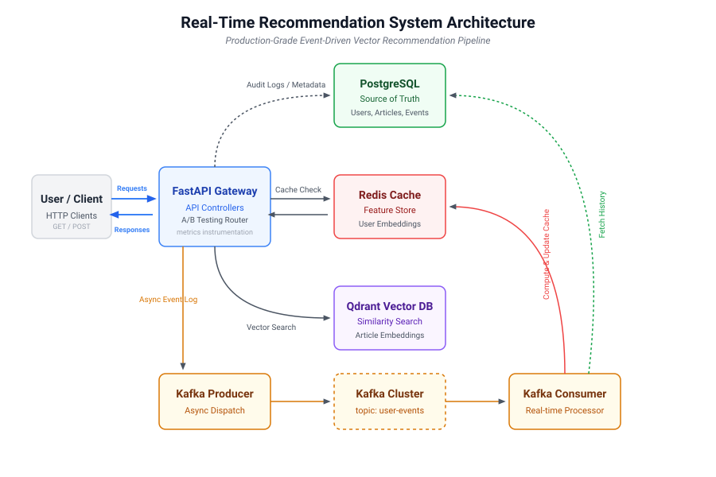
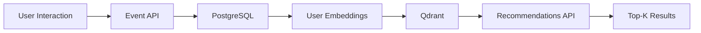
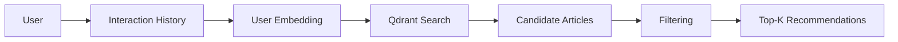
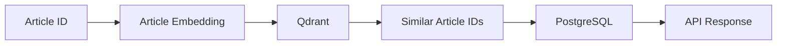
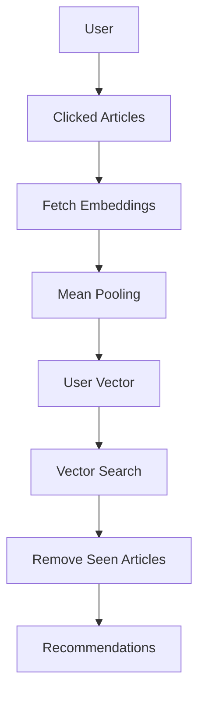
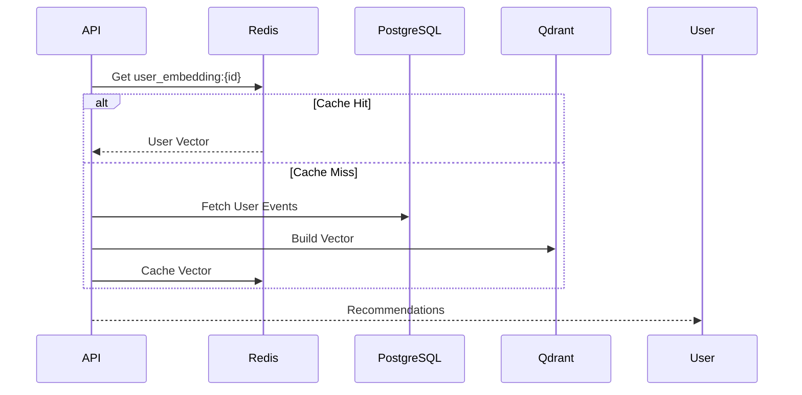
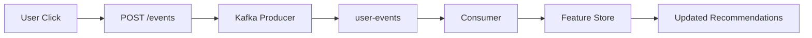
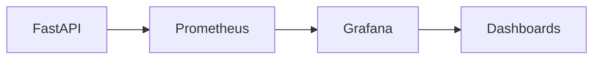
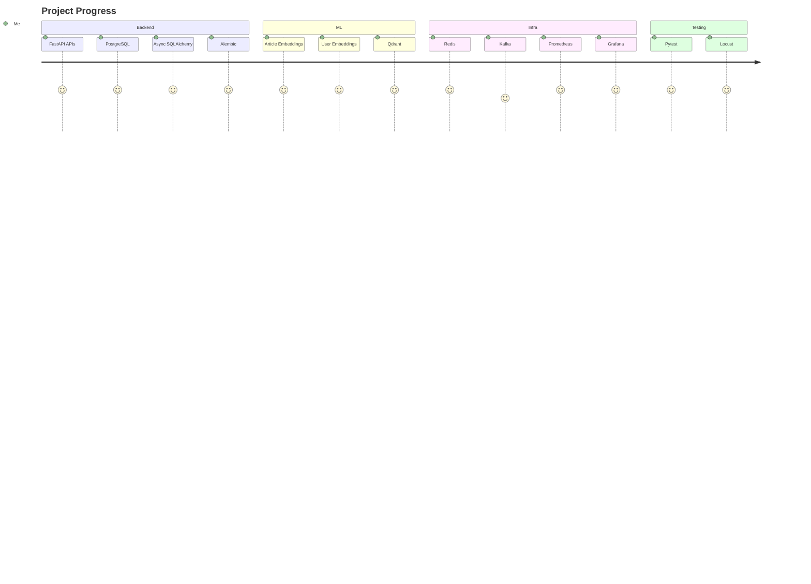

# Real-Time Recommendation System

Production-grade recommendation platform with semantic search, personalized retrieval, streaming infrastructure, caching, and observability.

---

## Architecture



### Monitoring & Metrics

The system is equipped with Prometheus and Grafana for complete observability:
* **Prometheus**: Dashboard accessible at `http://localhost:9090`
* **Grafana**: Pre-configured dashboard at `http://localhost:3000` (User: `admin`, Pass: `admin`) displaying recommendation latency metrics and Redis cache hit/miss rates.

### Interactive Simulator Dashboard

The system includes a pre-configured developer dashboard accessible at `http://localhost:8000/dashboard`:
* **Personalized Simulator**: Enter a user ID to retrieve Top-K recommendations, view assigned A/B test groups, and inspect live query response times plotted in a dynamic line chart.
* **Semantic Search Panel**: Query Qdrant vector database via natural language terms.
* **Retraining Orchestration**: Trigger Neural Collaborative Filtering (NCF) retraining pipeline in background worker threads and watch epoch loss progress indicators.
* **Category CTR Analytics**: View real-time category click distribution share via an interactive Chart.js doughnut chart alongside total interaction counters.
* **Server-Sent Events (SSE) Live Feed**: Stream active user click interactions live to the UI dashboard via persistent EventSource connections.

---

## System Overview



---

## Features

* Personalized recommendations
* Semantic article search
* User embeddings
* Vector similarity search
* Redis feature store
* Kafka event streaming
* Prometheus metrics
* Grafana dashboards
* Load testing with Locust
* Dockerized deployment

---

## Tech Stack

| Layer      | Technology            |
| ---------- | --------------------- |
| API        | FastAPI               |
| Database   | PostgreSQL            |
| ORM        | SQLAlchemy Async      |
| Migrations | Alembic               |
| Vector DB  | Qdrant                |
| Embeddings | Sentence Transformers |
| Cache      | Redis                 |
| Streaming  | Kafka                 |
| Monitoring | Prometheus + Grafana  |
| Testing    | Pytest + Locust       |
| Deployment | Docker Compose        |

---

## Recommendation Pipeline



---

## Semantic Search Pipeline



---

## Personalized Recommendation Flow



---

## Redis Feature Store



---

## Event Streaming Architecture



---

## Observability



Tracked Metrics:

* HTTP latency
* Recommendation latency
* Redis cache hits
* Redis cache misses
* Request throughput

---

## Load Testing

Tool:

```text
Locust
```

Configuration:

```text
Users: 100
Spawn Rate: 10/sec
```

Results:

| Metric       | Value     |
| ------------ | --------- |
| Failure Rate | 0%        |
| Throughput   | ~31 req/s |
| P50 Latency  | ~330 ms   |
| P95 Latency  | ~750 ms   |
| P99 Latency  | ~930 ms   |

---

## API Endpoints

### Recommendations

```http
GET /recommendations/{user_id}
GET /recommendations/personalized/{user_id}
```

### Articles

```http
GET /articles/{article_id}/similar
```

### Events

```http
POST /events
```

---

## Project Structure

```text
recommendation-system/

services/
├── api/
│   ├── routers/
│   ├── models/
│   ├── schemas/
│   └── db/
│
├── streaming/
│   ├── producer.py
│   └── consumer.py
│
├── cache/
│   └── redis_client.py

ml/
└── embeddings/
    ├── generate_embeddings.py
    ├── user_embeddings.py
    └── qdrant_client.py

data/
├── generator/
└── embeddings/

tests/
├── api/
└── load/

infra/
└── docker/
```

---

## Current Status



---

## Future Work

```text
Kafka Consumer Stabilization
Real-time Redis Updates
Online User Embeddings
Learning-to-Rank Models
Feature Store Expansion
Kubernetes Deployment
CI/CD Pipeline
A/B Testing Framework
```

---

## License

MIT License
